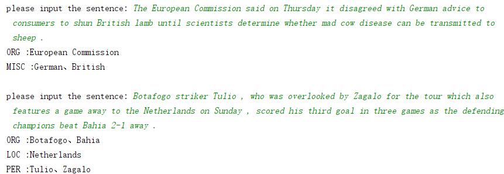

#BiLSTM-CRF for Named Entity Recognition(PyTorch)
A simple implementation of BiLSTM-CRF for NER in PyTorch. 
Including Chinese and English datasets. 
## Environment
PyTorch 1.0 、python 3.7
## DataSet
English: **CONLL2003** [**dataset**](https://github.com/davidsbatista/NER-datasets/tree/master/CONLL2003)  [**paper**](https://aclweb.org/anthology/W03-0419)

##Introduction
This model uses following 'BIO' tag system, that is, ['B-ORG', 'O', 'B-MISC', 'I-ORG', 'B-LOC', 'B-PER', 'I-PER', 'I-MISC', 'I-LOC'].  

ORG: organization

MISC: miscellaneous entities

PER: person

LOC: location

enter `python demo.py` to run the demo code.

enter `python main.py` to train a model
## demo output

## result
Loss value decreases to 0.058.  

F-value:0.8922

##Reference
[**Neural Architectures for Named Entity Recognition**](https://www.aclweb.org/anthology/N16-1030)

Guillaume Lample Miguel Ballesteros|
Sandeep Subramanian Kazuya Kawakami Chris Dyer
Carnegie Mellon University |NLP Group, Pompeu Fabra University