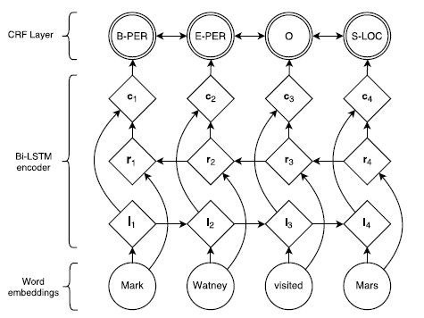

# BiLSTM-CRF for Named Entity Recognition(PyTorch)
A simple implementation of BiLSTM-CRF for NER in PyTorch. 
## Environment
PyTorch 1.0 、python 3.7
## DataSet
English: **CONLL2003** [**dataset**](https://github.com/davidsbatista/NER-datasets/tree/master/CONLL2003)  [**paper**](https://aclweb.org/anthology/W03-0419)
## Model Architecture

## Introduction
This model uses following 'BIO' tag system, that is, ['B-ORG', 'O', 'B-MISC', 'I-ORG', 'B-LOC', 'B-PER', 'I-PER', 'I-MISC', 'I-LOC'].  

ORG: organization

MISC: miscellaneous entities

PER: person

LOC: location
### 1)run the demo
enter `python demo.py` to run the demo code.

### 2)train from scratch
enter `python main.py` to train a model from scratch.

### 3)loading a checkpoint and continue to train
enter `python main.py -c 37_0_054__885.pth.tar` to train from the checkpoint "./pretrained_model/37_0_054__885.pth.tar".  

## Demo Output

## Result
Loss value decreases to 0.058.  

F-value:0.8922

## Reference
[**Neural Architectures for Named Entity Recognition**](https://www.aclweb.org/anthology/N16-1030)

Guillaume Lample  Miguel Ballesteros| Sandeep Subramanian  Kazuya Kawakami  Chris Dyer 
